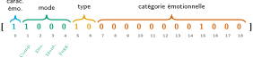

# Évaluation du modèle EMOTYC

Ce dépôt a été conçu pour évaluer les performances du modèle **[EMOTYC](https://huggingface.co/TextToKids/CamemBERT-base-EmoTextToKids)** sur le corpus [CyberAgression-Large](https://github.com/aollagnier/CyberAgression-Large), contenant des messages de cyberharcèlement en français rédigés par des jeunes âgés de 11 à 18 ans. EMOTYC a été conçu par Etienne ([2023](https://bdr.parisnanterre.fr/theses/internet/2023/2023PA100047/2023PA100047.pdf)) dans le cadre du projet [ANR TextToKids](https://texttokids.irisa.fr/publications/)


# 1. Cadre théorique et schéma d'annotation utilisé

## 1.1 L'Unité d'annotation

Le schéma d'annotation utilisé est celui proposé par Etienne et Battistelli ([2021](https://hal.science/hal-03263194v1/document)) et développé dans Etienne ([2023](https://bdr.parisnanterre.fr/theses/internet/2023/2023PA100047/2023PA100047.pdf)). Il modélise l'expression émotionnelle dans les textes à travers un triplet :

<p align="center">
  <code>SitEmo = (Span ; Catégorie émotionnelle ; Mode d'expression)</code>
</p>

- **Span** : un intervalle `[i, j]` qui délimite le segment textuel porteur de l'émotion au sein d'une phrase. Ce segment peut aller d'un seul signe de ponctuation (`!`) à une proposition entière.
- **Catégorie émotionnelle** : l'émotion exprimée (parmi 12 catégories, voir §1.2).
- **Mode d'expression** : la *manière* dont l'émotion est linguistiquement réalisée (parmi 4 modes, voir §1.3).

Une phrase peut contenir zéro, une ou plusieurs unités SitEmo, et les segments de deux SitEmo distinctes peuvent se chevaucher.

## 1.2 Les catégories émotionnelles

Le schéma distingue 12 catégories émotionnelles, chacune regroupant des émotions fines :

| Catégorie | Émotions fines associées |
|:---|:---|
| **Colère** | agacement, colère, contestation, désapprobation, énervement, fureur/rage, indignation, irritation, mécontentement, révolte… |
| **Dégoût** | dégoût, lassitude, répulsion |
| **Joie** | amusement, enthousiasme, exaltation, joie, plaisir |
| **Peur** | angoisse, appréhension, effroi, horreur, inquiétude, méfiance, peur, stress |
| **Surprise** | étonnement, stupeur, surprise |
| **Tristesse** | blues, chagrin, déception, désespoir, peine, souffrance, tristesse |
| **Admiration** | admiration |
| **Culpabilité** | culpabilité |
| **Embarras** | embarras, gêne, honte, humiliation |
| **Fierté** | fierté, orgueil |
| **Jalousie** | jalousie |
| **Autre** | amour, courage, curiosité, désir, espoir, haine, mépris, soulagement… |

## 1.3 Les modes d'expression

Le mode qualifie la *relation* entre le segment textuel et l'émotion qu'il exprime. Il repose sur la typologie de Micheli (2014), adaptée par Etienne ([2023](https://bdr.parisnanterre.fr/theses/internet/2023/2023PA100047/2023PA100047.pdf)) :

| Mode | Définition | Exemples |
|:---|:---|:---|
|  **Désigné** | L'émotion est nommée explicitement par un terme du lexique émotionnel. | « Paul est *heureux*. » → Joie |
|  **Comportemental** | L'émotion est inférée à partir de la description d'une manifestation physique ou comportementale. | « Elle *éclata en sanglots*. » → Tristesse |
| **Suggéré** | L'émotion est inférée par le lecteur à partir d'une situation décrite, conventionnellement associée à un ressenti. | « Paul *a gagné la course*. » → Joie/Fierté |
| **Montré** | L'émotion transparaît à travers les caractéristiques formelles de l'énoncé (interjections, ponctuation expressive, syntaxe fragmentée, etc.). | « *DEHORSSSSS* » → Colère |

Une unité SitEmo ne peut recevoir qu'un seul mode.

## 1.4 Les trois types

Les 12 catégories émotionnelles sont regroupées en trois types :

<br>
<p align="center">
  
</p>

## 1.5 Transposition au niveau phrastique : le vecteur à 19 labels


Pour l'entraînement et l'évaluation d'EMOTYC, les annotations fines (au niveau des segments) sont agrégées au niveau de la phrase par un "aplatissement". Cette agrégation rompt le lien entre une émotion spécifique et son mode d'expression. Pour une phrase contenant deux SitEmo (p. ex. une colère montrée et une tristesse désignée), le vecteur activera `Colère=1`, `Tristesse=1`, `Montré=1` et `Désigné=1`, sans permettre de reconstruire quel mode s'applique à quelle émotion.

Si au moins un segment de la phrase porte une propriété donnée, le label correspondant est activé (`1`) pour la phrase entière (si une phrase contient deux segments exprimant la colère, elle est associée à un vecteur dont le 10ème indice est 1, tout comme une phrase qui l'exprime sur un seul segment).


Ainsi, si une instance est étiquetée `Base = 1` dans le gold, cela peut être interprété comme une disjonction entre toutes les émotions appartenant à l'ensemble des « émotions de base » (cette disjonction étant inclusive, car plusieurs émotions peuvent être activées à la fois sur une même unité textuelle). Cette logique de disjonction est la même pour `Complexe = 1` (avec l'ensemble des émotions complexes) et pour `Emo = 1` (avec tous les labels émotionnels).

Il est possible de mesurer la « cohérence » des prédictions du modèle EMOTYC avec ce cadre théorique (p. ex., il ne devrait pas prédire `Base = 1` si aucune émotion de base n'est activée, ni prédire une émotion complexe (p. ex. `Culpabilité = 1`) sans prédire `Complexe = 1`). Cette cohérence n'est pas mesurée ici, mais elle l'est [dans ce script](https://github.com/GwenTsang/EMOTYC/blob/master/scripts/emotyc_sanity_check.py).


## 2. Architecture du modèle EMOTYC

EMOTYC est une version fine-tunée de [CamemBERT-base](https://arxiv.org/abs/1911.03894) avec une tête de classification multi-label ajoutée. La sortie est un vecteur de prédictions :

$$\hat{\mathbf{y}} = [\hat{y}_1, \ldots, \hat{y}_{19}] $$

où chaque $\hat{y}_i$ est dans {0, 1}.

Concrètement, une phrase qui exprime la joie sur un mode comportemental (p. ex. la phrase "Il lui a adressé un sourire") sera représentée par ce vecteur :
<br>
<p align="center">
  
</p>

Pour ce qui concerne le fine-tuning, Etienne et al. (2024, p. 5) rapportent une stratégie en deux temps. Dans une première phase, ils ont fait l'affinage sur la seule tâche de détection de présence/absence d'émotion (1 sortie binaire). Dans un second temps, ils ont fait un affinage multi-tâches sur les 19 labels simultanément, à partir des poids de la phase 1. L'optimiseur est Adam (lr = 10⁻⁵, pas de decay, batch size = 8) avec une pondération des classes plafonnée à 50 pour gérer le déséquilibre.

### 2.2 Format d'entrée

Le modèle a été entraîné avec le template :

```txt
before:{previous_sentence}current:{target_sentence}after:{next_sentence}
```

ce template est désigné "template BCA" (pour _Before, Current, After_).
Le fine-tuning a été réalisé avec `add_special_tokens=False`. En conséquence le premier token est `_be` (premier sous-mot de `"before"`). C'est l'état caché de ce token en position 0 à la 12ᵉ couche qui est transmis à la tête de classification.


Les labels `Emo`, `Base` et `Complexe` sont logiquement impliqués par les autres labels. Par exemple, `Base = 1` si et seulement si au moins l'une des 6 émotions de base est à `1`.


## 3. Données évaluées

Nous testons les performances d'EMOTYC sur deux corpus. D'une part, [`emotexttokids_gold_flat.xlsx`](golds/emotexttokids_gold_flat.xlsx), qui est le corpus d'entraînement d'EMOTYC, contenant des articles de presse jeunesse et de la littérature pour enfants. Le sous-ensemble TEST est disponible sur [HuggingFace](https://huggingface.co/datasets/TextToKids/EmoTextToKids-sentences).

D'autre part, un corpus contenant des messages de Cyber Harcèlement qui est sous-partie du corpus [CyberAgression-Large-v2](https://github.com/aollagnier/CyberAgression-Large) publié par Ollagnier ([2024](https://hal.science/hal-04514689v1/document)). Ce corpus peut être dit "hors-domaine" dans la mesure où le corpus de fine-tuning d'EMOTYC ne contient pas de messages numériques similaires. Nous avons annoté 781 lignes selon le schéma d'Etienne (2023) via Label Studio pour produire [`golds/CyberAdoAgg_gold_global_total.xlsx`](golds/CyberAdoAgg_gold_global_total.xlsx) en utilisant [ce script d'annotation](https://github.com/42009221/AnnotationsCyberAggAdo).


# 3. Données évaluées

Nous testons les performances d'EMOTYC sur deux corpus. D'une part, [`emotexttokids_gold_flat.xlsx`](golds/emotexttokids_gold_flat.xlsx), qui est le corpus d'entraînement d'EMOTYC, contenant des articles de presse jeunesse et de la littérature pour enfants. Le sous-ensemble TEST est disponible sur [HuggingFace](https://huggingface.co/datasets/TextToKids/EmoTextToKids-sentences).

D'autre part, un corpus contenant des messages de Cyber Harcèlement qui est sous-partie du corpus [CyberAgression-Large-v2](https://github.com/aollagnier/CyberAgression-Large) publié par Ollagnier ([2024](https://hal.science/hal-04514689v1/document)). Ce corpus peut être dit "hors-domaine" dans la mesure où le corpus de fine-tuning d'EMOTYC ne contient pas de messages numériques similaires. Nous avons annoté 781 lignes selon le schéma d'Etienne (2023) via Label Studio pour produire [`golds/CyberAdoAgg_gold_global_total.xlsx`](golds/CyberAdoAgg_gold_global_total.xlsx) en utilisant [ce script d'annotation](https://github.com/42009221/AnnotationsCyberAggAdo).


## 3.1 Échantillons

Le script [`prepare_xlsx_samples.py`](prepare_xlsx_samples.py) permet un échantillonnage aléatoire.


Le dossier [`results`](results) contient l'ensemble des inférences générées par les scripts d'inférence ; elles sont organisées par corpus évalué et par configuration testée.


Ce dossier gold contient également deux autres corpus qui sont des versions échantillonnées aléatoirement de CyberAggAdo. Le script d'échantillonnage aléatoire utilisé est [prepare_xlsx_samples.py](prepare_xlsx_samples.py), dans lequel un `argparse` permet de choisir entre un échantillonnage aléatoire ou non.

Ainsi, d'un côté, par un échantillonnage non-contigu, nous avons obtenu [randomSample120.xlsx](golds/random_sample_120.xlsx). Les performances d'EMOTYC sur ce XLSX sont présentées dans la section **4.9**. Dans la mesure où, dans ce XLSX, les phrases ne se suivent pas, il n'y aurait pas de sens à utiliser l'option `use-context`.
C'est la raison pour laquelle nous échantillonnons aussi en "blocs contigus". Cela permet de pouvoir avoir plusieurs fichiers XLSX séparés, et ainsi d'utiliser le script [`orchestrate_emotyc_folder.py`](orchestrate_emotyc_folder.py). Les résultats sur ce corpus sont exposés dans la section **4.8**.


# 4. Performances du modèle EMOTYC

### 4.1 Métriques utilisées

La précision mesure la fiabilité des prédictions positives :

$$
\text{Precision} = \frac{TP}{TP + FP}
$$

Elle évalue, parmi les instances prédites comme positives par le modèle, la proportion réellement correcte. Une baisse de précision sur CyberAggAdo indique une augmentation des faux positifs : EMOTYC attribue à tort un label émotionnel. Cela suggère que certains indices lexicaux ou contextuels valides dans TTK deviennent trompeurs dans CyberAggAdo.

Le rappel mesure la capacité du modèle à retrouver les instances réellement positives :

$$
\text{Recall} = \frac{TP}{TP + FN}
$$

Il porte sur l’ensemble des instances pour lesquelles `y=1`. Une baisse de rappel indique une augmentation des faux négatifs : EMOTYC ne détecte plus certaines occurrences. Cela suggère par ex. que l’émotion concernée est exprimée dans CyberAggAdo par des formes lexicales, discursives ou contextuelles différentes de celles apprises sur TTK (EMOTYC n'ayant jamais vu ces formes, il ne les détecte pas).


### 4.2 Répliquer les résultats officiels sur le corpus Test

Etienne et al. ([2024](https://arxiv.org/abs/2405.14385)) rapportent les performances suivantes, sur le sous ensemble TEST du corpus TTK, avec les phrases adjacentes (contexte) injectées dans le template BCA et des seuils à 0.5 pour tous les labels :

|  | Rappel (Macro) | Précision (Macro) | Macro F1 |
| :--- | :---: | :---: | :---: |
| Présence d'une émotion | 0.76 | 0.74 | 0.75 |
| Mode d'expression | 0.63 | 0.67 | 0.64 |
| Type | 0.56 | 0.66 | 0.60 |
| Catégorie émotionnelle | 0.40 | 0.46 | 0.42 |

Nous avons essayé de reproduire à l'identique ces paramètres, en partant du sous-ensemble TEST du [corpus TTK donné sur HuggingFace](https://huggingface.co/datasets/TextToKids/EmoTextToKids-sentences/blob/main/data/test-00000-of-00001.parquet) ainsi qu'avec les poids du modèle donnés sur [HuggingFace](https://huggingface.co/TextToKids/CamemBERT-base-EmoTextToKids) à travers le script [`emotyc_predict_parquet.py`](emotyc_predict_parquet.py), qui a été exécuté dans ce [notebook Colab T4](https://colab.research.google.com/drive/17dVMtpKE4Ca2eKJ_tDvaUa1FF-e6igjn?usp=sharing). Mais les performances obtenues sont supérieures à celles qui sont documentées dans l'article :

|  | Rappel (Macro) | Précision (Macro) | Macro F1 |
| :--- | :---: | :---: | :---: |
| Présence d'une émotion | 0.93 | 0.92 | 0.92 |
| Mode d'expression | 0.81 | 0.82 | 0.81 |
| Type | 0.76 | 0.83 | 0.79 |
| Catégorie émotionnelle | 0.55 | 0.60 | 0.57 |

Une hypothèse pour expliquer ces écarts serait que les résultats donnés dans l'article découlent d'une moyenne des performances des différents "checkpoints" du modèle EMOTYC (une moyenne de ses performances à travers les epochs), et qu'on accède, via le dépôt HuggingFace, aux meilleurs checkpoints (aux meilleurs poids).

Performances détaillées label par label :

*(Les illustrations SVG de cette section ont été retirées)*


### 4.3 Performance sur CyberAggAdo avec les mêmes paramètres

Le script [`orchestrate_emotyc_folder.py`](orchestrate_emotyc_folder.py) (avec l'option `--groups`) permet de faire une comparaison honnête en utilisant exactement la même configuration que celle ayant donné les résultats exposés dans la section **4.2** ci-dessus. On obtient donc :

|  | Rappel (Macro) | Précision (Macro) | Macro F1 |
| :--- | :---: | :---: | :---: |
| Présence d'une émotion | 0.63 | 0.63 | 0.63 |
| Mode d'expression | 0.25 | 0.34 | 0.28 |
| Type | 0.49 | 0.42 | 0.42 |
| Catégorie émotionnelle | 0.35 | 0.20 | 0.23 |


### Points de vigilance

- Le contexte BCA n'est valide que si l'ordre des lignes représente de vraies
  phrases voisines. Il ne faut pas utiliser `--use-context` sur un échantillon
  non contigu ou mélangé.
- Les données CyberAggAdo contiennent des messages sensibles et potentiellement
  offensants. Vérifier les contraintes de diffusion avant tout partage.

## Structure

```txt
.
├── common.py                         # labels, inférence ONNX, métriques
├── emotyc_predict.py                 # inférence sur un XLSX gold
├── emotyc_predict_parquet.py         # inférence sur le test TextToKids parquet
├── orchestrate_emotyc_folder.py      # inférence sur un dossier de XLSX
├── prepare_xlsx_samples.py           # génération de sous-échantillons XLSX
├── baseline_classifiers.py           # baselines TF-IDF + classifieurs
├── dataviz_scripts/                  # rapports HTML, SVG, heatmap
├── golds/                            # fichiers gold XLSX/parquet
├── model_onnx/                       # config, tokenizer, poids ONNX local
├── results/                          # résultats JSON/rapports générés
└── slides/                           # matériel Beamer
```

## Installation

Créer et activer un environnement virtuel est recommandé :

```bash
python3 -m venv .venv
source .venv/bin/activate
bash setup.sh
```

`setup.sh` installe `requirements.txt`, puis vérifie ou télécharge :

```txt
model_onnx/model.onnx
```

Par défaut, les poids sont téléchargés depuis :

```txt
https://huggingface.co/GwendalTsang/EMOTYC-ONNX/resolve/main/model.onnx
```

## Commandes principales

### Inférence sur un fichier XLSX

Sans contexte :

```bash
python emotyc_predict.py \
  --xlsx ./golds/CyberAdoAgg_gold_global_total.xlsx \
  --out_dir ./results/CyberAggAdo/no_context
```

Avec contexte :

```bash
python emotyc_predict.py \
  --xlsx ./golds/CyberAdoAgg_gold_global_total.xlsx \
  --out_dir ./results/CyberAggAdo/context \
  --use-context
```

Le script écrit :

```txt
emotyc_predictions_summary.json
```

### Inférence sur le test TextToKids parquet

```bash
python emotyc_predict_parquet.py
```

Ce script lit par défaut :

```txt
golds/TTK_test.parquet
```

### Préparer des échantillons XLSX

Échantillons contigus, adaptés à l'usage du contexte :

```bash
python prepare_xlsx_samples.py \
  --mode context \
  --sample-size 50 \
  --seed 42
```

Échantillons non contigus, à évaluer sans contexte :

```bash
python prepare_xlsx_samples.py \
  --mode nocontext \
  --sample-size 30 \
  --seed 42
```

### Orchestrer un dossier de XLSX

Avec contexte, comportement par défaut :

```bash
python orchestrate_emotyc_folder.py ./results/prepared_xlsx_samples/subsets --groups
```

Sans contexte :

```bash
python orchestrate_emotyc_folder.py ./results/prepared_xlsx_samples/subsets --no-context --groups
```

### Générer un rapport HTML

```bash
python dataviz_scripts/json_summary_to_html.py \
  --json ./results/All_cyberadoagg_context/emotyc_predictions_summary.json \
  --out ./results/All_cyberadoagg_context/rapport.html \
  --groups
```

### Générer une heatmap de transfert

```bash
python dataviz_scripts/delta_heatmap.py \
  --ttk ./results/TextToKids/ContextTemplateAvecEspace/emotyc_predictions_summary.json \
  --cyber ./results/All_cyberadoagg_context/emotyc_predictions_summary.json \
  --out ./results/heatmap_delta.html
```

### Lancer les baselines

```bash
python baseline_classifiers.py
```

Les résultats sont écrits dans :

```txt
results/baselines/baseline_results.json
```

## Résultats disponibles

Les résultats déjà présents dans `results/` donnent la tendance suivante :

| Corpus / configuration | N | Template | Macro-F1 | Micro-F1 |
|---|---:|---|---:|---:|
| TextToKids avec contexte | 27 911 | `bca_spaced_context` | 0.739 | 0.897 |
| TextToKids sans contexte | 27 911 | `bca_spaced_no_context` | 0.684 | 0.850 |
| CyberAggAdo complet avec contexte | 781 | `bca_spaced_context` | 0.282 | 0.473 |
| CyberAggAdo orchestré avec contexte | 781 | `bca_spaced_context` | 0.282 | 0.472 |
| Sous-échantillons contigus | 200 | `bca_spaced_context` | 0.270 | 0.470 |
| Échantillon 120 lignes | 120 | `bca_spaced_context` | 0.247 | 0.492 |

Lecture principale : EMOTYC conserve une partie de sa capacité à détecter une
charge émotionnelle globale, mais le transfert vers CyberAggAdo dégrade fortement
les modes d'expression et les catégories émotionnelles.

Quelques labels critiques sur `results/All_cyberadoagg_context/` :

| Label | Gold + | Pred + | F1 | Précision | Rappel |
|---|---:|---:|---:|---:|---:|
| `Emo` | 398 | 453 | 0.660 | 0.620 | 0.706 |
| `Colere` | 289 | 252 | 0.458 | 0.492 | 0.429 |
| `Degout` | 80 | 0 | 0.000 | 0.000 | 0.000 |
| `Autre` | 62 | 141 | 0.148 | 0.106 | 0.242 |
| `Montree` | 300 | 289 | 0.472 | 0.481 | 0.463 |
| `Suggeree` | 54 | 19 | 0.082 | 0.158 | 0.056 |

Le cas le plus problématique est `Degout` : il apparaît 80 fois dans le gold
CyberAggAdo, mais n'est jamais prédit à seuil 0.5.

## Baselines

| Modèle | Macro-F1 | Micro-F1 | Exact match |
|---|---:|---:|---:|
| EMOTYC zéro-shot OOD | 0.282 | 0.473 | n.d. |
| TF-IDF + LinearSVC | 0.267 | 0.540 | 0.318 |
| TF-IDF + RandomForest | 0.173 | 0.530 | 0.400 |
| TF-IDF char n-grams + LinearSVC | 0.324 | 0.600 | 0.368 |
